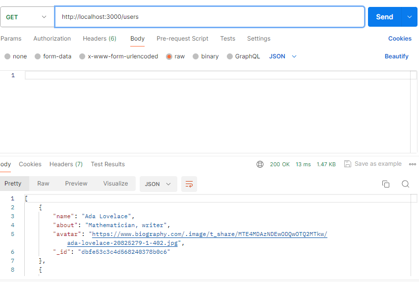

# Projeto 5:  EUA Afora

## Visão geral

**Descrição**
**Tecnologias e Técnicas**
**Página no GitHub**

### Descrição

O projeto EUA Afora visa mostrar o mundo existente além das fronteiras do local onde se vive, apresentando diversos lugares em países diferentes com suas paisagens distintas e peculiares. No momento, a nova etapa do projeto consiste na criação de um servidor criado pelo próprio desenvolvedor, para que através deste sejam feitas as chamadas API.

### Tecnologias e Técnicas

#### Express

Nosso framework amado, usado para a criação do servidor. Através dele é possível: inicia o servidor em localhost:3000 com a recarga automática habilitada, através do comando "npm run dev"; realizar o roteamento para as rotas que retornam os usuários e cartões previamente criados - no momento, as solicitações implementadas foram com o método GET; obter endereços para os arquivos de dados com o módulo "path"; ler os arquivos atráves dos métodos do módulo "fs"; e incluir módulos com o "require".

#### Linter

Os linters são usados para encontrar erros e manter a consistência do código. Por ser pré-configurado, ele permite a configuração das regras, e para esta etapa, foi adicionada uma exceção para o uso do underline.

#### Postman

Usado para testar as solicitações do servidor.

#### Estilo de código

Foi usado: camelCase para os nomes de funções e variáveis; substantivos somente como nomes de variáveis, que descrevem o que está armazenado neles; nomes descritivos para as funções, mostrando o que elas fazem.

#### Códigos de Status

200 - resposta padrão (OK);
404 - para usuários inexsistentes com o id solicitado e para endereços(urls) inexistentes;
500 - como erro padrão no servidor;

### Páginas do GitHub

Acredito que depois de ter um breve resumo do que se trata o projeto, e das técnicas/tecnologias usadas para a sua construção, nada será mais esclarecedor que ver com os próprios olhos o resultado final do website. Porém, o nosso front-end especial estará disponível em breve... Aguarde!
